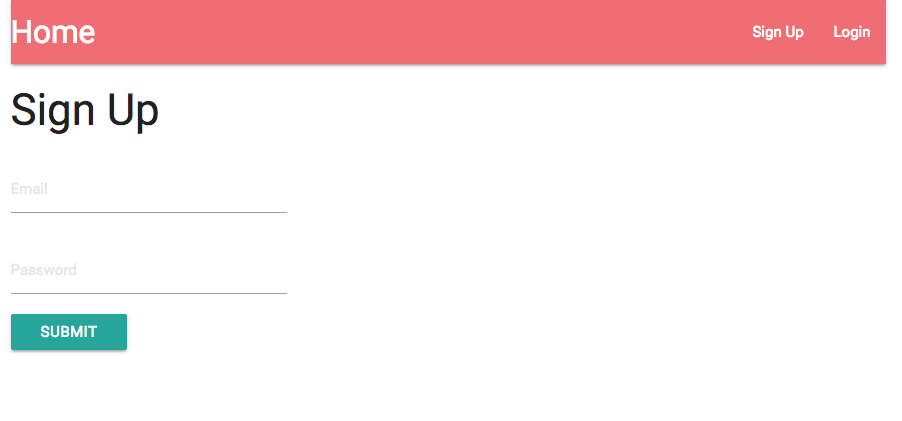
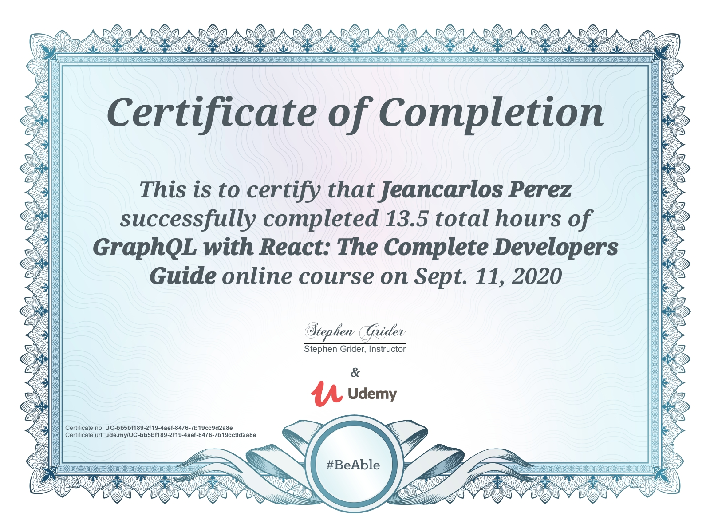

# GraphQL with React: The Complete Developers Guild

This is a Udemy Course I took and followed along to build a MERN project using Node.js, Express.js, MongoDB, React, and GraphQL

   

## Table of contents

- [Udemy Course](#udemy-course)
- [About](#about)
- [Projects](#project)
- [Skills Used](#skills-used)
- [Course Certification](#udemy-certification)
- [Setup](#setup)
- [Sources & References](#sources-&-references)
- [Scripts](#Scripts,-APIs-&-More)

## Udemy Course:

## About:

Build amazing single page applications with React JS and GraphQL. Master fundamental concepts behind structuring GraphQL servers. Realize the power of building flexible data schemas.

Be the engineer who explains how GraphQL works to everyone else, because you know the fundamentals so well. Become fluent in the ecosystem supporting GraphQL, including the differences between Apollo and Relay.

## Project

  

## Skills & Tools Used:

## Udemy Certification:

  

## Setup:

Go into the Lyrical project directory.

1. Run `npm install`
2. Run `npm run dev`

## Sources & References:

### Media:

- Icons: https://icons8.com
- Photos: https://pexels.com
- Fonts & More: https://fontawesome.com

### Scripts, APIs & More:
